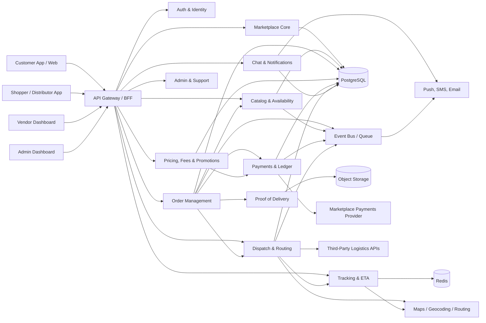
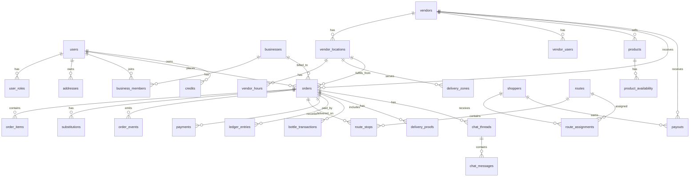
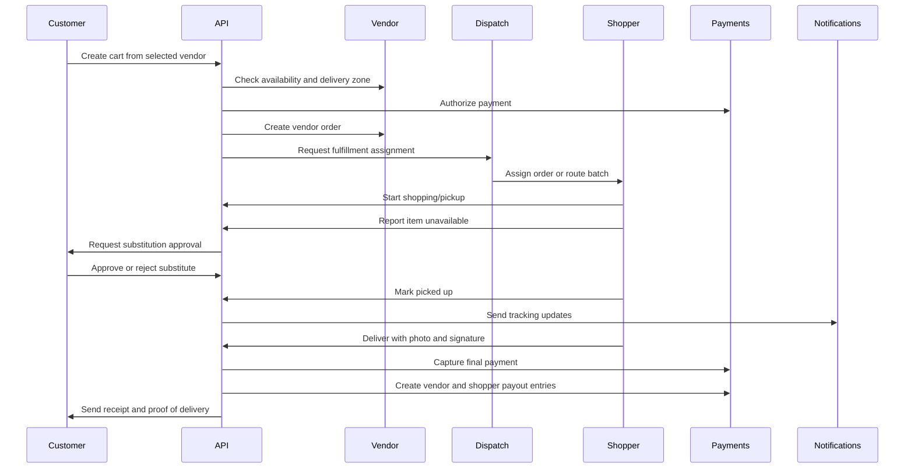

# PureStream System Architecture

## 1. Product Summary

PureStream is a bulk water delivery marketplace similar to Instacart. Customers and business accounts order bulk water from specific water brands/vendors. Approved shoppers/distributors purchase, pick up, and deliver the order, while some orders may also be fulfilled by vendor drivers or third-party logistics partners.

The platform supports delivery-only ordering, on-demand and scheduled deliveries, real-time vendor availability, substitutions with customer approval, route optimization, proof of delivery, vendor payouts, shopper/distributor payouts, business contract pricing, bottle deposits, and empty bottle pickup credits.

## 2. Confirmed Requirements

### Users

- Customers/consumers
- Business customers
- Shoppers/distributors selected by the app company
- Independent water brands/vendors
- Internal admins/support/operations

### Ordering

- Customers buy from specific stores/vendors.
- Delivery only.
- On-demand and scheduled delivery are required.
- Recurring subscriptions are out of scope for MVP.
- Scheduled orders can be modified or canceled.
- Substitutions are supported.
- Customers approve substitutions in real time.
- Customers can save multiple addresses and delivery instructions.
- Business accounts are required.
- Business accounts may have contract pricing.

### Vendors

- Vendors are independent water suppliers/brands.
- Vendors can have multiple physical locations.
- Vendors manage catalog, pricing, availability, hours, inventory status, and delivery zones.
- Vendors need a dashboard.
- Vendor payouts are required.
- Low-stock alerts are required.

### Fulfillment

- Fulfillment is mixed:
  - Platform shoppers/distributors
  - Vendor drivers
  - Third-party logistics providers
- Shoppers/distributors are individuals selected by the app company.
- Shoppers/distributors both shop and deliver when assigned.
- Drivers can handle multiple orders per route.
- Route optimization is required.
- Route batching across multiple vendors is required.
- Heavy-item constraints matter.
- Delivery zones are required.
- Delivery price is a set flat fee.
- Proof of delivery requires photo and signature.
- Customers need live tracking and ETA.
- Customer-to-shopper/distributor chat is required.

### Inventory

- Real-time inventory/availability is required.
- Customers see available/unavailable, not exact stock counts.
- Low-stock alerts are required.
- Detailed warehouse-style inventory is not required for MVP.

### Payments

- Vendor payouts happen through the platform.
- Shopper/distributor payouts happen through the platform.
- Monetization includes:
  - Vendor commission
  - Customer service fee
  - Business contract pricing
- No tipping.
- Promotions are required.
- Bottle deposit system is required.
- Empty bottle pickup credits are required.

## 3. High-Level Architecture



## 4. Recommended Architecture Style

Use a modular monolith for MVP with clear service boundaries inside one backend codebase. This is faster to build and easier to operate than microservices, while still preparing the product for later extraction into services.

Recommended backend modules:

- Identity and accounts
- Vendor management
- Catalog and availability
- Cart and checkout
- Order management
- Substitution workflow
- Payments and ledger
- Bottle deposits and pickup credits
- Dispatch and route planning
- Tracking and ETA
- Chat and notifications
- Proof of delivery
- Promotions and business pricing
- Admin/support operations

Move modules into independent services only after scale or team ownership demands it.

## 5. Core Applications

### Customer App / Web

- Browse vendors by address and delivery zone.
- View vendor catalog and availability.
- Place on-demand or scheduled orders.
- Save multiple addresses and delivery instructions.
- Use promo codes, credits, and business pricing.
- Approve or reject substitutions in real time.
- Chat with shopper/distributor.
- Track order status, ETA, and live location.
- View proof of delivery, receipts, and bottle credit history.

### Shopper / Distributor App

- Accept assigned jobs or route batches.
- View vendor pickup details.
- Shop/pick products from vendors.
- Report unavailable items.
- Suggest substitutions with photo, price, and quantity.
- Navigate optimized multi-stop routes.
- Capture photo and signature proof of delivery.
- Record empty bottle pickups.
- View earnings and payout history.

### Vendor Dashboard

- Manage locations.
- Manage catalog, prices, and availability.
- Set hours and service zones.
- Receive incoming order visibility.
- Confirm availability or mark stockouts.
- Set low-stock thresholds.
- View sales, commissions, payouts, and disputes.
- Create vendor-level promotions if enabled by admin.

### Admin Dashboard

- Manage customers, businesses, vendors, shoppers, and distributors.
- Approve shoppers/distributors.
- Configure fees, commissions, promotions, and business pricing.
- View and intervene in orders.
- Manually dispatch or reassign routes.
- Issue refunds, credits, and adjustments.
- Resolve disputes.
- Monitor low-stock, fulfillment, payout, and support metrics.

## 6. Major Backend Modules

### Identity & Account Service

Responsibilities:

- User authentication
- Customer profiles
- Business accounts
- Business members and roles
- Vendor users and roles
- Shopper/distributor onboarding and approval
- Address book and delivery instructions

Core roles:

- Consumer customer
- Business owner
- Business manager
- Business member
- Shopper/distributor
- Vendor owner
- Vendor staff
- Admin
- Support agent

### Marketplace & Vendor Service

Responsibilities:

- Vendor profiles
- Vendor locations
- Vendor operating hours
- Delivery zones
- Vendor commissions
- Vendor status and onboarding
- Vendor payout account status

### Catalog & Availability Service

Responsibilities:

- Product catalog
- Product categories
- Product pricing
- Product availability
- Available/unavailable display state
- Low-stock thresholds and alerts
- Lightweight reservations during checkout

MVP recommendation:

- Track product availability as `available`, `low`, or `unavailable` internally.
- Show customers only `available` or `unavailable`.
- Let vendors optionally store quantity for low-stock alerts, but avoid showing exact counts to customers.

### Cart & Checkout Service

Responsibilities:

- Cart creation
- Address eligibility checks
- Vendor delivery zone checks
- Scheduled time-window selection
- Fee calculation
- Promo application
- Bottle deposit calculation
- Payment authorization
- Order creation

### Order Management Service

Responsibilities:

- Order lifecycle state machine
- Modification/cancellation rules
- Vendor confirmation
- Shopper assignment
- Fulfillment status
- Substitution workflow
- Final reconciliation
- Receipt and invoice generation

Suggested order statuses:

- `draft`
- `placed`
- `payment_authorized`
- `vendor_pending`
- `vendor_confirmed`
- `shopper_assigned`
- `shopping`
- `substitution_pending`
- `ready_for_pickup`
- `picked_up`
- `out_for_delivery`
- `delivered`
- `completed`
- `canceled`
- `refunded`
- `failed`

### Substitution Service

Responsibilities:

- Item unavailable events
- Shopper substitution suggestions
- Customer approval/rejection
- Price adjustment
- Timeout handling
- Final order reconciliation

Recommended MVP timeout rule:

- If the customer does not respond within a configured window, skip the unavailable item and adjust the order total.

### Pricing, Fees & Promotions Service

Responsibilities:

- Product subtotal
- Flat delivery fee
- Service fee
- Vendor commission
- Business contract pricing
- Promo codes
- Referral credits
- Loyalty credits
- Bottle deposits
- Empty bottle pickup credits
- Tax integration if required

MVP fee formula:

```text
customer_total =
  product_subtotal
  + flat_delivery_fee
  + service_fee
  + bottle_deposits
  + taxes
  - promotions
  - account_credits
```

Vendor settlement:

```text
vendor_payout =
  eligible_product_subtotal
  - vendor_commission
  - vendor_adjustments
```

Shopper/distributor settlement:

```text
shopper_payout =
  route_base_pay
  + per_stop_pay
  + heavy_item_adjustments
  + reimbursements
  - penalties_or_adjustments
```

### Payments & Ledger Service

Responsibilities:

- Customer payment authorization and capture
- Vendor payouts
- Shopper/distributor payouts
- Refunds and partial refunds
- Credits
- Bottle deposits
- Bottle pickup credits
- Promotions accounting
- Platform fee accounting
- Audit ledger

Recommended provider:

- Stripe Connect for marketplace payments, vendor payouts, and shopper payouts.

Ledger entries should be immutable. Corrections should be represented as reversing or adjustment entries.

### Dispatch & Routing Service

Responsibilities:

- Fulfillment method selection
- Shopper/distributor assignment
- Vendor-driver assignment support
- Third-party logistics integration
- Route batching
- Multi-vendor route planning
- Time-window optimization
- Heavy-item and vehicle capacity constraints
- Manual admin override

Routing constraints:

- Vendor pickup location
- Customer delivery location
- Delivery windows
- Driver service zone
- Vehicle capacity
- Product weight/volume
- Stairs/elevator/loading dock instructions
- Proof of delivery requirements

### Tracking & ETA Service

Responsibilities:

- Driver location ingestion
- Live tracking during active delivery
- ETA calculation
- Route progress
- Status events
- Customer-facing map
- Privacy controls

Location sharing should be active only while the shopper/distributor is assigned and the order is in an active fulfillment state.

### Chat & Notifications Service

Responsibilities:

- Order-specific chat
- Substitution approval notifications
- Delivery status notifications
- Vendor/admin notifications
- Low-stock alerts
- Payment failure/refund notifications
- Push, SMS, and email routing

Recommended channels:

- Push notifications for apps
- SMS for urgent substitution and delivery events
- Email for receipts, business invoices, and payout reports
- In-app notifications for all parties

### Proof of Delivery Service

Responsibilities:

- Photo upload
- Signature capture
- Timestamp
- GPS coordinates
- Delivery notes
- Per-stop proof for batched routes

Photo and signature assets should be stored in object storage, with metadata in the database.

## 7. Data Model

### Entity Relationship Overview



### Key Tables

#### users

- `id`
- `email`
- `phone`
- `name`
- `status`
- `created_at`
- `updated_at`

#### user_roles

- `id`
- `user_id`
- `role`
- `scope_type`
- `scope_id`

#### businesses

- `id`
- `name`
- `billing_email`
- `payment_terms`
- `contract_pricing_id`
- `status`

#### business_members

- `id`
- `business_id`
- `user_id`
- `role`
- `status`

#### addresses

- `id`
- `owner_type`
- `owner_id`
- `label`
- `street`
- `city`
- `state`
- `postal_code`
- `latitude`
- `longitude`
- `delivery_instructions`
- `stairs_count`
- `has_elevator`
- `has_loading_dock`
- `parking_notes`

#### vendors

- `id`
- `name`
- `status`
- `commission_rate`
- `payout_account_id`
- `support_email`
- `support_phone`

#### vendor_locations

- `id`
- `vendor_id`
- `name`
- `address_id`
- `status`
- `timezone`

#### delivery_zones

- `id`
- `owner_type`
- `owner_id`
- `zone_type`
- `radius_miles`
- `postal_codes`
- `polygon_geojson`
- `flat_delivery_fee`
- `is_active`

#### products

- `id`
- `vendor_id`
- `name`
- `description`
- `category`
- `unit_size`
- `weight_lbs`
- `deposit_amount`
- `price`
- `status`

#### product_availability

- `id`
- `product_id`
- `vendor_location_id`
- `availability_status`
- `internal_quantity`
- `low_stock_threshold`
- `updated_at`

#### orders

- `id`
- `customer_user_id`
- `business_id`
- `vendor_id`
- `vendor_location_id`
- `delivery_address_id`
- `fulfillment_type`
- `status`
- `scheduled_window_start`
- `scheduled_window_end`
- `subtotal`
- `delivery_fee`
- `service_fee`
- `deposit_total`
- `discount_total`
- `tax_total`
- `total`
- `payment_status`
- `created_at`
- `updated_at`

#### order_items

- `id`
- `order_id`
- `product_id`
- `product_name_snapshot`
- `quantity`
- `unit_price`
- `deposit_amount`
- `status`
- `substitution_allowed`

#### substitutions

- `id`
- `order_id`
- `original_order_item_id`
- `suggested_product_id`
- `suggested_name_snapshot`
- `suggested_price`
- `suggested_quantity`
- `suggested_by_user_id`
- `customer_decision`
- `expires_at`
- `status`

#### shoppers

- `id`
- `user_id`
- `approval_status`
- `vehicle_type`
- `vehicle_capacity_lbs`
- `service_zone_id`
- `payout_account_id`
- `status`

#### routes

- `id`
- `status`
- `planned_start_at`
- `planned_end_at`
- `total_weight_lbs`
- `optimization_provider`
- `created_at`

#### route_stops

- `id`
- `route_id`
- `order_id`
- `stop_type`
- `sequence_number`
- `address_id`
- `eta`
- `arrived_at`
- `completed_at`
- `status`

#### payments

- `id`
- `order_id`
- `provider`
- `provider_payment_intent_id`
- `amount_authorized`
- `amount_captured`
- `status`

#### ledger_entries

- `id`
- `order_id`
- `account_type`
- `account_id`
- `entry_type`
- `amount`
- `currency`
- `reference_type`
- `reference_id`
- `created_at`

#### payouts

- `id`
- `recipient_type`
- `recipient_id`
- `provider_transfer_id`
- `amount`
- `status`
- `scheduled_at`
- `paid_at`

#### bottle_transactions

- `id`
- `order_id`
- `customer_user_id`
- `business_id`
- `transaction_type`
- `bottle_count`
- `amount`
- `status`
- `recorded_by_user_id`
- `created_at`

Transaction types:

- `deposit_charged`
- `empty_pickup_recorded`
- `credit_issued`
- `credit_applied`
- `credit_reversed`

#### delivery_proofs

- `id`
- `order_id`
- `route_stop_id`
- `photo_url`
- `signature_url`
- `latitude`
- `longitude`
- `signed_by_name`
- `notes`
- `created_at`

#### chat_threads

- `id`
- `order_id`
- `status`

#### chat_messages

- `id`
- `thread_id`
- `sender_user_id`
- `message_type`
- `body`
- `attachment_url`
- `created_at`

## 8. Order Lifecycle



## 9. API Outline

### Auth & Users

- `POST /auth/register`
- `POST /auth/login`
- `GET /me`
- `PATCH /me`
- `GET /me/addresses`
- `POST /me/addresses`
- `PATCH /me/addresses/{addressId}`
- `DELETE /me/addresses/{addressId}`

### Businesses

- `POST /businesses`
- `GET /businesses/{businessId}`
- `POST /businesses/{businessId}/members`
- `PATCH /businesses/{businessId}/members/{memberId}`
- `GET /businesses/{businessId}/orders`
- `GET /businesses/{businessId}/credits`

### Vendors

- `GET /vendors?addressId={addressId}`
- `GET /vendors/{vendorId}`
- `GET /vendors/{vendorId}/locations`
- `POST /vendor-admin/vendors/{vendorId}/locations`
- `PATCH /vendor-admin/locations/{locationId}`
- `POST /vendor-admin/locations/{locationId}/hours`
- `POST /vendor-admin/locations/{locationId}/zones`

### Catalog & Availability

- `GET /vendors/{vendorId}/products`
- `POST /vendor-admin/products`
- `PATCH /vendor-admin/products/{productId}`
- `PATCH /vendor-admin/products/{productId}/availability`
- `GET /vendor-admin/low-stock-alerts`

### Cart & Checkout

- `POST /carts`
- `POST /carts/{cartId}/items`
- `PATCH /carts/{cartId}/items/{itemId}`
- `DELETE /carts/{cartId}/items/{itemId}`
- `POST /carts/{cartId}/price`
- `POST /carts/{cartId}/apply-promo`
- `POST /carts/{cartId}/checkout`

### Orders

- `GET /orders`
- `GET /orders/{orderId}`
- `PATCH /orders/{orderId}/schedule`
- `POST /orders/{orderId}/cancel`
- `GET /orders/{orderId}/events`
- `GET /orders/{orderId}/receipt`

### Substitutions

- `POST /shopper/orders/{orderId}/substitutions`
- `GET /orders/{orderId}/substitutions/pending`
- `POST /orders/{orderId}/substitutions/{substitutionId}/approve`
- `POST /orders/{orderId}/substitutions/{substitutionId}/reject`

### Shopper / Distributor

- `GET /shopper/assignments`
- `POST /shopper/assignments/{assignmentId}/accept`
- `POST /shopper/orders/{orderId}/start-shopping`
- `POST /shopper/orders/{orderId}/picked-up`
- `POST /shopper/orders/{orderId}/location`
- `POST /shopper/orders/{orderId}/deliver`
- `POST /shopper/orders/{orderId}/bottle-pickup`
- `GET /shopper/payouts`

### Dispatch & Routes

- `POST /admin/routes/optimize`
- `GET /admin/routes`
- `GET /admin/routes/{routeId}`
- `POST /admin/routes/{routeId}/assign`
- `POST /admin/orders/{orderId}/reassign`

### Tracking & Chat

- `GET /orders/{orderId}/tracking`
- `GET /orders/{orderId}/chat`
- `POST /orders/{orderId}/chat/messages`

### Payments, Credits & Payouts

- `GET /me/credits`
- `GET /orders/{orderId}/ledger`
- `POST /admin/orders/{orderId}/refund`
- `POST /admin/credits`
- `GET /vendor-admin/payouts`
- `GET /admin/payouts`

### Proof of Delivery

- `GET /orders/{orderId}/proof`
- `POST /shopper/orders/{orderId}/proof`

## 10. Infrastructure Plan

### MVP Stack

- Frontend:
  - React Native for customer and shopper apps
  - React or Next.js for vendor/admin dashboards
- Backend:
  - Node.js/NestJS, Ruby on Rails, Django, or Laravel
  - Modular monolith
- Database:
  - PostgreSQL with PostGIS for geospatial zones and route eligibility
- Cache and realtime:
  - Redis for live driver location and short-lived checkout state
  - WebSockets or managed realtime service for tracking/chat/substitution updates
- Queue/events:
  - BullMQ, Sidekiq, Celery, or cloud queue
- Object storage:
  - S3-compatible storage for proof photos, signatures, receipts
- Payments:
  - Stripe Connect
- Maps:
  - Google Maps Platform, Mapbox, or HERE
- Notifications:
  - Firebase Cloud Messaging/APNs for push
  - Twilio for SMS
  - SendGrid/Postmark for email

### Production Deployment

- API containers behind load balancer
- Managed PostgreSQL with automated backups
- Redis managed cache
- Background worker pool
- Separate realtime gateway if needed
- Object storage with private access and signed URLs
- Observability with logs, metrics, traces, and alerting
- Feature flags for rollout of fulfillment providers, pricing rules, and promotions

## 11. MVP Roadmap

### Phase 1: Marketplace Foundation

- User accounts
- Customer address book
- Vendor onboarding
- Vendor locations
- Vendor catalog
- Vendor availability
- Delivery zones
- Customer vendor browsing
- Cart and checkout
- Flat delivery fee
- Service fee
- Vendor commission
- Stripe Connect setup

### Phase 2: Orders & Fulfillment

- Order lifecycle
- Scheduled delivery windows
- Order modification/cancellation rules
- Shopper/distributor onboarding and approval
- Basic assignment
- Shopper app order workflow
- Photo and signature proof of delivery
- Customer order status tracking

### Phase 3: Substitutions, Chat & Notifications

- Real-time substitution requests
- Customer approval/rejection
- Order chat
- Push/SMS/email notifications
- Vendor low-stock alerts
- Final payment reconciliation

### Phase 4: Routing & Multi-Order Delivery

- Route batching
- Multi-vendor route support
- Driver capacity/weight constraints
- Heavy-item delivery instructions
- ETA calculation
- Live map tracking
- Manual dispatch dashboard

### Phase 5: Business Accounts & Advanced Pricing

- Business organizations
- Business members and roles
- Multiple business locations
- Business contract pricing
- Business order history
- Business receipts/invoices

### Phase 6: Deposits, Pickup Credits & Promotions

- Bottle deposits
- Empty bottle pickup recording
- Customer credit ledger
- Promo codes
- Referral credits
- Loyalty credits
- Vendor/admin promotion controls

### Phase 7: Scale & Operations

- Third-party logistics integration
- Vendor driver workflows
- Advanced support tools
- Dispute handling
- Payout reporting
- Fraud controls
- Analytics dashboards

## 12. Key Design Decisions

### Use Availability Instead of Exact Customer Stock Counts

Customers see available/unavailable. Vendors may manage internal quantity and low-stock thresholds, but exact counts remain hidden. This avoids customer confusion and reduces stock mismatch support issues.

### Keep Payments Ledger-First

Because the platform includes vendor payouts, shopper payouts, service fees, commissions, deposits, credits, promotions, refunds, and business pricing, every money movement should create immutable ledger entries.

### Treat Fulfillment as a Strategy

Each order should have a fulfillment type:

- `platform_shopper`
- `vendor_driver`
- `third_party_logistics`

This keeps dispatch flexible and prevents fulfillment-specific logic from leaking throughout the order system.

### Build Route Optimization as a Separate Module

Route optimization will become complex quickly because of multi-vendor batching, delivery windows, heavy water loads, and vehicle capacity. Keep it isolated behind a routing interface so the provider or algorithm can change later.

### Make Bottle Deposits and Pickup Credits Ledger Events

Deposits and empty bottle pickups should not be treated as loose notes on orders. They should create auditable transactions that affect customer credits and payment reconciliation.

## 13. Open Decisions

These are not blockers for architecture, but they should be decided before detailed product design:

- Exact bulk water product types at launch.
- Exact delivery window options.
- Whether customer chat includes vendors or only shoppers/distributors.
- Whether vendor-created promotions are allowed at MVP.
- Whether vendor drivers use the same shopper app or a lighter vendor-driver mode.
- Exact cancellation fee rules.
- Exact substitution timeout rule.
- Exact shopper/distributor pay formula.
- Exact low-stock notification channels.
- Tax provider and tax requirements by launch market.
